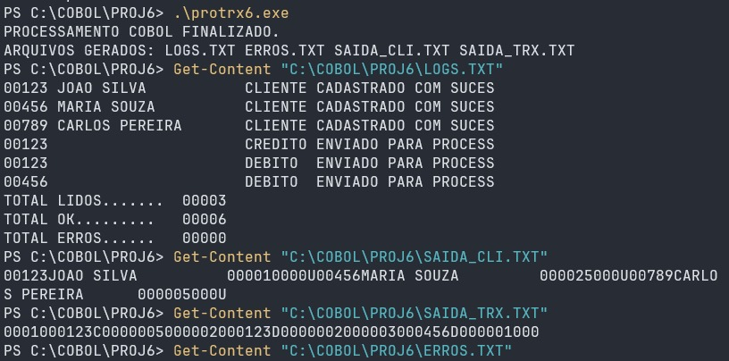
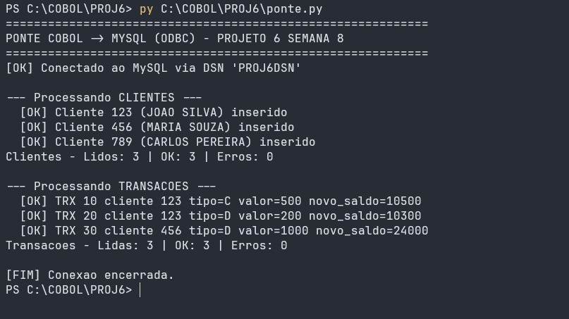
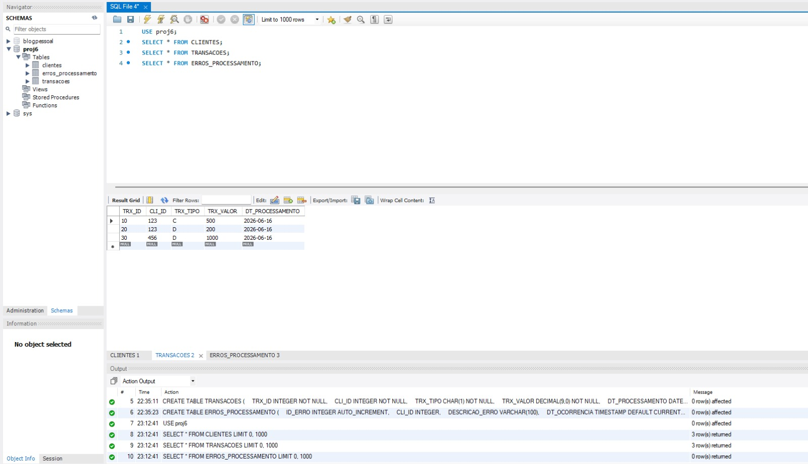
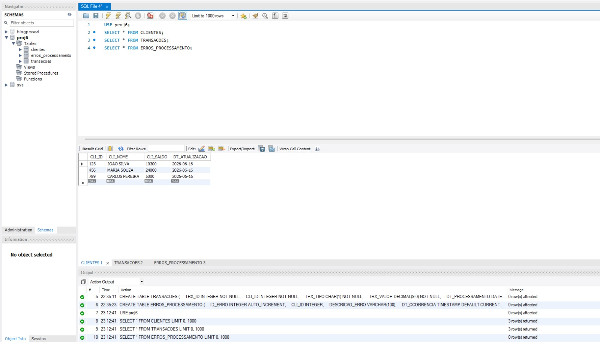
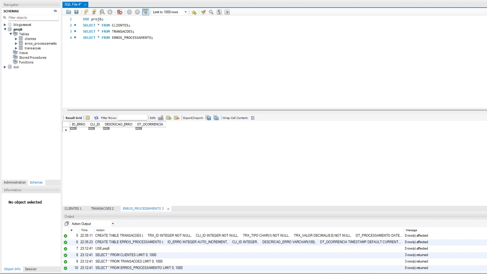

# 🏦 PROJ6 - Sistema de Contas Bancárias em COBOL

Projeto desenvolvido para a trilha COBOL do Programa Acelera Maker (Montreal Informática / PUC Minas).

---

## 📖 Sobre o Projeto

O PROJ6 consiste em um sistema batch para processamento de transações bancárias, utilizando COBOL para leitura e validação de arquivos, seguindo um cenário típico de processamento em ambiente Mainframe.

O objetivo é realizar o processamento de clientes e transações bancárias, aplicando regras de negócio, atualizando saldos, gerando relatórios e registrando erros de processamento.

Originalmente o projeto foi especificado para utilização de DB2 em ambiente Mainframe. Entretanto, devido às limitações do ambiente TK5/Hercules utilizado durante o curso, foi adotada uma arquitetura híbrida validada pela orientação da disciplina:

* Ambiente Mainframe para desenvolvimento COBOL e execução JCL.
* Ambiente Local para integração com banco de dados MySQL através de ODBC.

---

# 🎯 Objetivos

O sistema realiza:

* Leitura de arquivos de clientes.
* Leitura de arquivos de transações.
* Validação das regras de negócio.
* Processamento de créditos e débitos.
* Atualização de saldos.
* Registro de erros.
* Geração de logs.
* Geração de arquivos de saída.
* Persistência dos dados em banco MySQL através de uma ponte Python.

---

# 🏗 Arquitetura da Solução

```text
CLIENTES.TXT + TRANSACOES.TXT
                │
                ▼
         PROTRX6.CBL
                │
     ┌──────────┼──────────┐
     │          │          │
     ▼          ▼          ▼
 LOGS.TXT   ERROS.TXT  Arquivos Saída
                           │
                           ▼
                      ponte.py
                           │
                           ▼
                    MySQL + ODBC
```

---

# 📂 Estrutura do Projeto

```text
PROJ6/
├── imgs/
│   ├── image.png
│   ├── image2.png
│   ├── image3.png
│   ├── image4.png
│   └── image5.png
│
├── mainframe/
│   ├── PROTRX6.cbl
│   ├── CLICOPY.cpy
│   ├── TRXCOPY.cpy
│   ├── PROJ6JCL.jcl
│   ├── CLIENTES.TXT
│   ├── TRANSACS.TXT
│   ├── LOGS.TXT
│   └── ERROS.TXT
│
├── local/
│   ├── PROTRX6.cbl
│   ├── ponte.py
│   ├── protrx6.exe
│   ├── LOGS.TXT
│   ├── SAIDA_CLI.TXT
│   └── SAIDA_TRX.TXT
│
├── run_all.bat
└── README.md
```

---

# 🖼 Evidências de Execução

As imagens abaixo registram as principais etapas da solução local, desde a execução do COBOL até a conferência dos dados gravados no MySQL.

## 1. Execução do programa COBOL



Captura da execução do `protrx6.exe` no PowerShell. A tela mostra o processamento finalizado e a geração dos arquivos `LOGS.TXT`, `ERROS.TXT`, `SAIDA_CLI.TXT` e `SAIDA_TRX.TXT`. Também aparece a consulta ao conteúdo dos arquivos gerados, com três clientes, três transações processadas, seis registros OK e nenhum erro.

## 2. Ponte Python gravando no MySQL



Captura da execução do `ponte.py`, responsável pela integração COBOL -> MySQL via ODBC. A evidência mostra a conexão com o DSN `PROJ6DSN`, a inserção de três clientes, o processamento de três transações e o encerramento da conexão sem erros.

## 3. Consulta da tabela TRANSACOES



Evidência no MySQL Workbench da tabela `TRANSACOES`, contendo as transações importadas pela ponte Python: crédito para o cliente 123, débito para o cliente 123 e débito para o cliente 456.

## 4. Consulta da tabela CLIENTES



Evidência no MySQL Workbench da tabela `CLIENTES`, com os saldos já atualizados após o processamento das transações: João Silva com saldo 10300, Maria Souza com saldo 24000 e Carlos Pereira com saldo 5000.

## 5. Consulta da tabela ERROS_PROCESSAMENTO



Evidência no MySQL Workbench da tabela `ERROS_PROCESSAMENTO`. Nesta execução, a consulta retorna zero registros, confirmando que não houve erros de processamento nos dados utilizados.


# 🖥 Ambiente Mainframe

### Plataforma

* Hercules TK5
* MVS 3.8j
* TSO/ISPF
* COBOL 74
* JCL

### Datasets Utilizados

| Dataset               | Tipo                  |
| --------------------- | --------------------- |
| HERC01.PROJ6.CLIENTES | Arquivo de clientes   |
| HERC01.PROJ6.TRANSACS | Arquivo de transações |
| HERC01.PROJ6.LOGS     | Log de processamento  |
| HERC01.PROJ6.ERROS    | Registro de erros     |
| HERC01.PROJ6.COBOL    | Biblioteca COBOL      |
| HERC01.PROJ6.JCL      | Biblioteca JCL        |

---

# 💻 Ambiente Local

### Ferramentas

* OpenCobolIDE 4.7.6
* GnuCOBOL 2.0.0
* Python 3
* PyODBC
* MySQL Server
* MySQL ODBC Connector

### Objetivo

Simular a integração originalmente prevista com DB2 utilizando:

```text
COBOL → Arquivos de Saída → Python → MySQL
```

---

# 🗄 Modelo de Banco de Dados

## CLIENTES

```sql
CREATE TABLE CLIENTES (
    CLI_ID INTEGER NOT NULL,
    CLI_NOME VARCHAR(30) NOT NULL,
    CLI_SALDO DECIMAL(9,0) NOT NULL,
    DT_ATUALIZACAO DATE,
    PRIMARY KEY (CLI_ID)
);
```

## TRANSACOES

```sql
CREATE TABLE TRANSACOES (
    TRX_ID INTEGER NOT NULL,
    CLI_ID INTEGER NOT NULL,
    TRX_TIPO CHAR(1) NOT NULL,
    TRX_VALOR DECIMAL(9,0) NOT NULL,
    DT_PROCESSAMENTO DATE,
    PRIMARY KEY (TRX_ID)
);
```

## ERROS_PROCESSAMENTO

```sql
CREATE TABLE ERROS_PROCESSAMENTO (
    ID_ERRO INTEGER AUTO_INCREMENT,
    CLI_ID INTEGER,
    DESCRICAO_ERRO VARCHAR(100),
    DT_OCORRENCIA TIMESTAMP DEFAULT CURRENT_TIMESTAMP,
    PRIMARY KEY (ID_ERRO)
);
```

---

# 📄 Layout dos Arquivos

## CLIENTES.TXT

| Campo     | Tamanho |
| --------- | ------- |
| CLI_ID    | 5       |
| CLI_NOME  | 20      |
| CLI_SALDO | 9       |

Total: **34 bytes por registro**

Exemplo:

```text
00123JOAO SILVA          000010000
00456MARIA SOUZA         000025000
00789CARLOS PEREIRA      000005000
```

---

## TRANSACOES.TXT

| Campo     | Tamanho |
| --------- | ------- |
| CLI_ID    | 5       |
| TRX_ID    | 5       |
| TRX_TIPO  | 1       |
| TRX_VALOR | 9       |

Total: **20 bytes por registro**

Exemplo:

```text
0012300010C000000500
0012300020D000000200
0045600030D000001000
```

### Tipos de Operação

| Código | Operação |
| ------ | -------- |
| C      | Crédito  |
| D      | Débito   |

---

# 📌 Regras de Negócio

### Cadastro de Clientes

* Não permitir clientes duplicados.
* Nome do cliente é obrigatório.
* Atualizar informações quando necessário.

### Processamento de Transações

* Cliente deve existir.
* Tipo da transação deve ser válido.
* Valor deve ser maior que zero.
* Débito exige saldo suficiente.
* Crédito sempre permitido.
* Saldo deve ser atualizado após a operação.

---

# 🚨 Tratamento de Erros

O sistema registra:

* Cliente inexistente.
* Tipo de transação inválido.
* Valor zerado.
* Saldo insuficiente.
* Erros de banco de dados.

Os erros são armazenados em:

```text
ERROS.TXT
```

e também na tabela:

```sql
ERROS_PROCESSAMENTO
```

---

# 📊 Relatórios Gerados

## Relatório de Processamento

Informações consolidadas:

* Total de registros lidos.
* Total processado.
* Total com erro.

## Relatório Detalhado

Informações por cliente:

* Cliente.
* Operação.
* Status da execução.

## Log de Processamento

Arquivo:

```text
LOGS.TXT
```

Contendo:

* Quantidade de registros processados.
* Erros encontrados.
* Mensagens de execução.
* Falhas de banco de dados.

---

# 🔄 Controle Transacional

Conforme especificado no projeto:

* COMMIT a cada 100 registros.
* ROLLBACK em caso de erro SQL.
* Tratamento dos principais SQLCODEs.
* Registro detalhado de falhas.

---

# 🚀 Como Executar

## Execução no Mainframe

1. Transferir os arquivos para os datasets.
2. Atualizar o programa COBOL.
3. Submeter o JCL:

```jcl
SUBMIT 'HERC01.PROJ6.JCL(PROJ6JCL)'
```

4. Verificar o retorno da execução.

---

## Execução Local

### Compilar

```powershell
cobc -x -o protrx6.exe PROTRX6.cbl
```

### Executar COBOL

```powershell
.\protrx6.exe
```

### Executar integração com banco

```powershell
py ponte.py
```

---

### Automatizar (Windows)

Se o executável `protrx6.exe` estiver presente na raiz e você quiser executar tudo em sequência, existe um arquivo de conveniência `run_all.bat` na raiz que executa o `.\protrx6.exe` seguido pela ponte Python.

```powershell
.\run_all.bat
```


# 📈 Resultados Esperados

Após a execução:

* Clientes cadastrados ou atualizados.
* Transações registradas.
* Saldos atualizados.
* Logs gerados.
* Erros registrados.
* Dados persistidos no banco.

---

# 📚 Conceitos Aplicados

Durante o desenvolvimento foram utilizados conceitos de:

* COBOL 74
* GnuCOBOL
* JCL
* Processamento Batch
* Arquivos Sequenciais
* Copybooks
* Mainframe
* MySQL
* ODBC
* Python
* Controle Transacional
* Tratamento de Erros
* Integração entre sistemas legados e bancos relacionais
